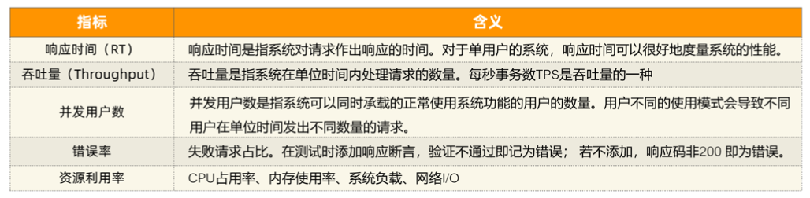
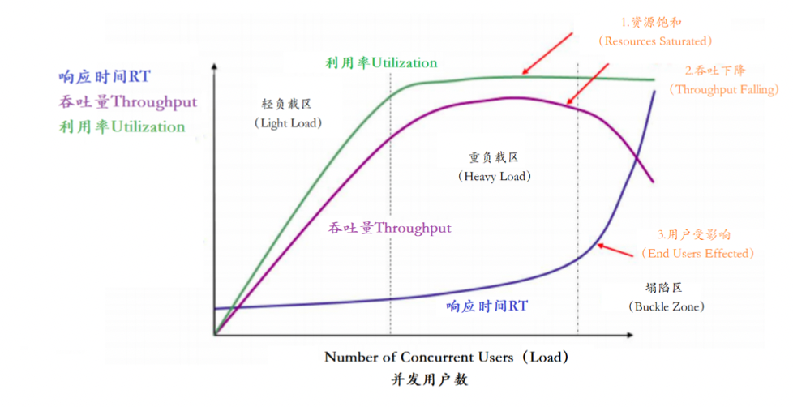
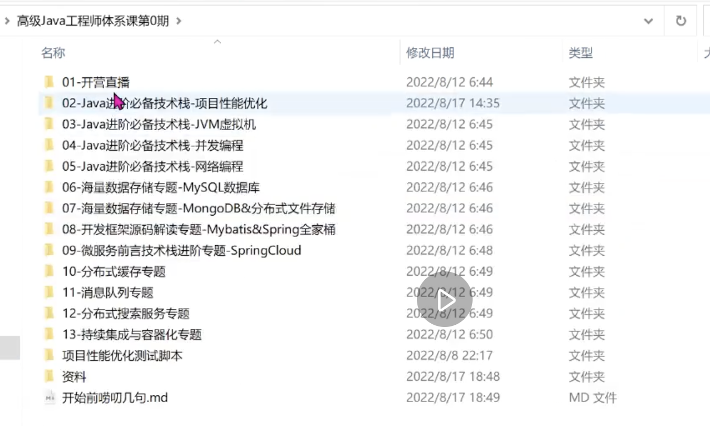

# 什么是压力测试？

- 压力测试(英语:Stress testing)是针对特定系统或是组件，为要确认其稳定性而特意进行的严格测

试。会让系统在超过正常使用条件下运作，然后再确认其结果。

- 压力测试是对系统不断施加压力，来预估系统服务能力的一种测试。

# 为什么对系统压测?有没有必要

- 压不压测要看场景! 一般而言，只有在系统基础功能测试验证完成、系统趋于稳定的情况下，才会进行压测

# 压测的目的是什么?

- 当负载逐渐增加时，观察系统各项性能指标的变化情况是否有异常

- 发现系统的性能短板，进行针对性的性能优化

- 判断系统在高并发情况下是否会报错，进程是否会挂掉

- 测试在系统某个方面达到瓶颈时，粗略估计系统性能上限

# 压力测试性能指标

 

以上主要的四种性能指标【响应时间、并发用户数、吞吐量、资源使用率】它们之间存在一定的相关 性，共同反映出性能的不同方面。

在这个图中，定义了三条曲线、三个区域、两个点以及三个状态描述。三条曲线:

   吞吐量的曲线(紫色)

   利用率(绿色)

   响应时间曲线(深蓝色)

三个区域:

轻负载区(Light Load) 重负载区(Heavy Load) 塌陷区(Buckle Zone)

两个点:

最优并发用户数(The Optimum Number of Concurrent Users)

最大并发用户数(The Maximum Number of Concurrent Users) 

三个状态描述:

资源饱和(Resource Saturated) 吞吐下降(Throughput Falling) 用户受影响(End Users Effected)

