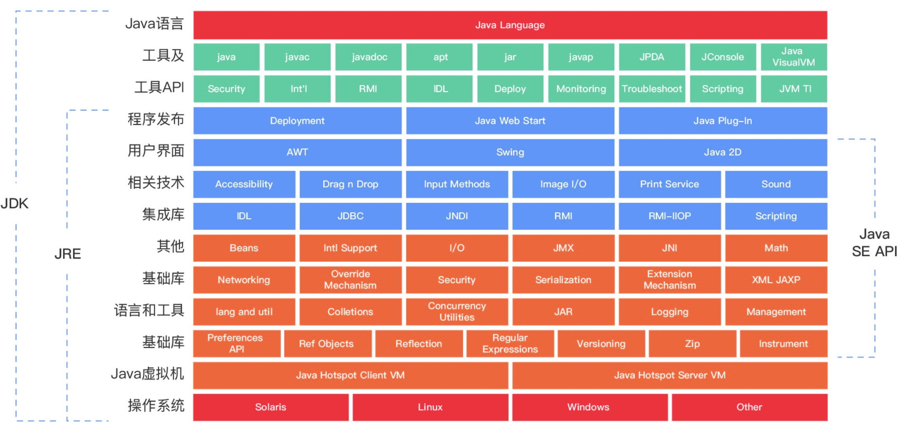
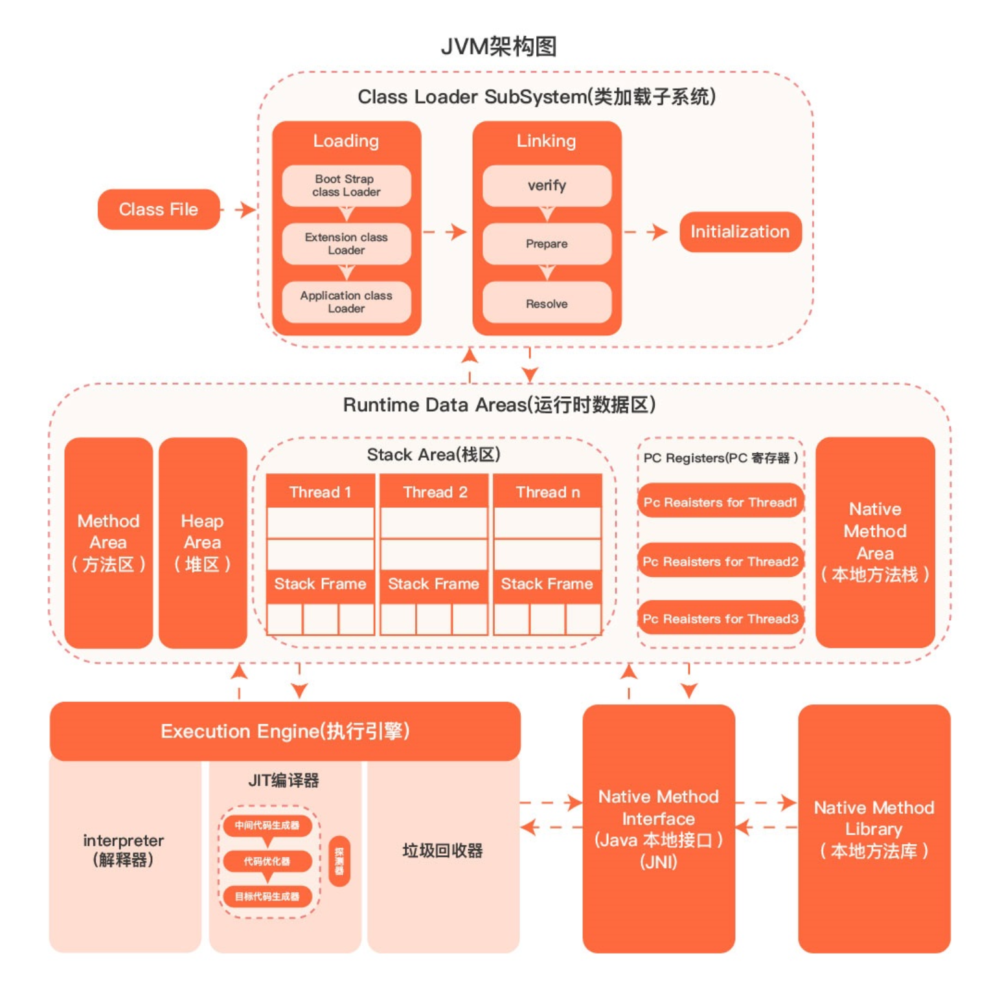

# 1.1 什么是 JVM?

1. 广义上指的是一种规范
2. 狭义上的是JDK中的JVM虚拟机
3. JVM 是由各个厂商来实现，比如hotspot

# 1.2 Java 技术体系

1. Java程序设计语言
2. Java类库API
3. 来自商业机构和开源社区的第三方Java类库(Google\Apached等)
4. Java虚拟机，各种硬件平台上的Java虚拟机实现

# 1.3 JVM 架构图

# 1.4 Java 和 JVM 的关系

1. JVM是宿主，Java 开发的程序则寄生在宿主上
2. Java，Kotlin、Clojure、JRuby、Groovy等运行于Java虚拟机上的编程语言及其相关的程序都属于Java技术体系中的一员