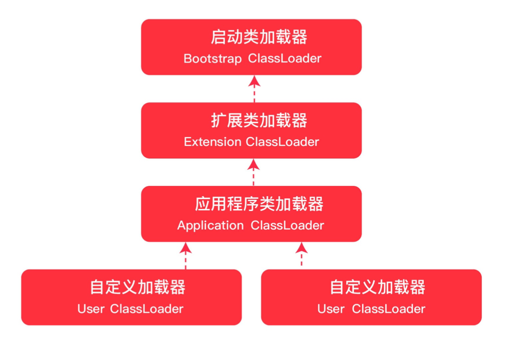

# 2.1 类加载的时机

1. 遇到 new、getstatic、putstatic 和 invokestatic 这四条指令时，如果对应的类没有初始化，则要对对应的类先进行初始化

   ```java
   public class Student{
       private static int age ;
       public static void method(){}
   }
   //Student.age
   //Student.method();
   //new Student();
   ```

2. 使用 java.lang.reflect 包方法时对类进行反射调用的时候
   ```java
   Class c = Class.forname("com.hero.Student");
   ```

3. 初始化一个类的时候发现其父类还没初始化，要先初始化其父类
4. 当虚拟机开始启动时，用户需要指定一个主类(main)，虚拟机会先执行这个主类的初始化

# 2.2 类加载的过程

	

1. 类加载步骤

   - 全限定名称>>>二进制字节流加载 class 文件

   - 字节流的静态数据结构>>>方法区的运行时数据结构
   - 创建字节码 Class 对象

2. 类加载途径

   - jar/war
   - jsp 生成的 class
   - 数据库中的二进制字节流
   - 网络中的二进制字节流
   - 动态代理生成的二进制字节流

3. 类的生命周期

   

# 2.3 类加载器



1. 启动类加载器 Bootstrap ClassLoader
   - 负责加载 JAVA_HOME\lib 目录中的，或通过 -Xbootclasspath 参数指定路径中的，且被虚拟机认可(按文件名识别，如 rt.jar)的类
   - 由 C++ 实现，不是 ClassLoader 的子类
2. 扩展类加载器 Extension ClassLoader
   - 负责加载 JAVA_HOME\lib\ext 目录中的，或通过 java.ext.dirs 系统变量指定路径中的类库
3. 应用程序类加载器 Application ClassLoader
   - 负责加载用户路径(classpath)上的类库
4. 自定义类加载器 User ClassLoader
   - 加载应用程序之外的类文件
   - 在汽车行驶的时候，为汽车更换轮子
   - 案例：JRebel

**自定义类加载器案例**

1. 新建一个 User.java 类

   ```java
   public class User {
       public void print() {
           System.out.println("****User****");
       }
   }
   ```

2. 将类 copy 到目录 /Users/lishaofei/Downloads

3. 编译类：

   ```java
   javac User.java
   ```
4. 自定义类加载器，继承 ClassLoader，重写 findClass() 方法，调用 defineClass() 方法

   ```java
   package com.zero.snippet.jvm;
   
   import java.io.*;
   import java.lang.reflect.Method;
   
   /**
    * 自定义类加载器案例
    *
    * @author lishaofei
    * @date 2022/9/12 11:31
    */
   public class MyCustomClassLoader extends ClassLoader {
   
       private final String classpath;
   
       public MyCustomClassLoader(String classpath) {
           this.classpath = classpath;
       }
   
       public static void main(String[] args) throws Exception {
           //自定义类加载器的加载路径(事先在该目录使用同版本 jdk 编译一个 class 类，参考 model.User)
           MyCustomClassLoader myCustomClassLoader = new MyCustomClassLoader("/Users/lishaofei/Downloads");
           // 类全限定名称
           Class<?> c = myCustomClassLoader.loadClass("User");
   
           if (c != null) {
               // 创建对象
               Object obj = c.newInstance();
               // 获取对象的指定方法
               Method method = c.getMethod("print", (Class<?>[]) null);
               // 执行方法
               method.invoke(obj);
               // 打印该类的类加载器
               System.out.println(c.getClassLoader().toString());
               // 打印内容：com.zero.snippet.jvm.MyCustomClassLoader@2f2c9b19
           }
       }
   
       @Override
       protected Class<?> findClass(String name) throws ClassNotFoundException {
           try {
               // 输入流，通过类的全限定名称加载文件到字节数组
               // 将文件目录中的 class 文件，以字节码流输入内存
               byte[] classDate = getData(name);
               if (classDate != null) {
                   //defineClass方法将字节数组数据 转为 字节码对象
                   return defineClass(name, classDate, 0, classDate.length);
               }
           } catch (IOException e) {
               e.printStackTrace();
           }
   
           return super.findClass(name);
       }
   
       //加载类的字节码数据
       private byte[] getData(String className) throws IOException {
           String path = classpath + File.separatorChar +
                   className.replace('.', File.separatorChar) + ".class";
           try (InputStream in = new FileInputStream(path);
                ByteArrayOutputStream out = new ByteArrayOutputStream()) {
               byte[] buffer = new byte[2048];
               int len;
               while ((len = in.read(buffer)) != -1) {
                   out.write(buffer, 0, len);
               }
               return out.toByteArray();
           } catch (FileNotFoundException e) {
               e.printStackTrace();
           }
           return null;
       }
   
   }
   ```

5. 执行自定义类加载器的 main 方法
6. 输出结果如下	

   ```java
   ****User****
   com.zero.snippet.jvm.MyCustomClassLoader@3b81a1bc
   ```

# 2.4 类加载的机制

	

1. 自底向上：检查类是否被加载，只要某个classloader已加载就视为已加载此类，保证此类只所有ClassLoader加载一次
2. 自定向下：执行加载，由上层来逐层尝试加载此类，防篡改