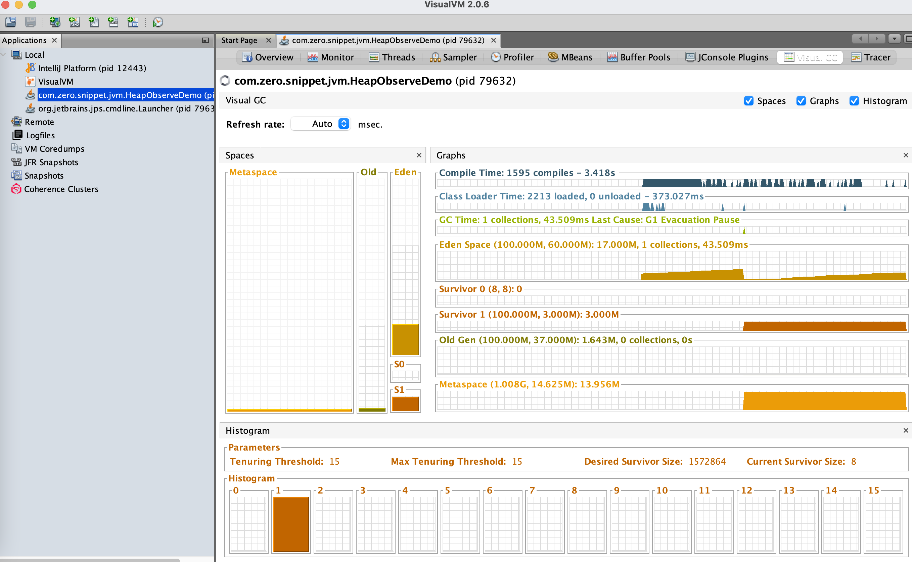

# 3.1 整体构成


1. 程序执行区域、线程独享、无需垃圾回收：虚拟机栈、本地方法栈、程序计数器
2. 数据存储区域、线程共享、需要垃圾回收：堆、方法区、字符传常量池

​	

# 3.2 虚拟机栈

1. 每个线程会创建私有的栈内存，生命周期与线程相同
2. 每个方法执行时会创建一个栈帧，每个方法从开始调用到执行完成，都对应着一个栈帧入栈出栈的过程
3. 栈帧（Stack Frame）是用于支持 JVM 进行方法执行的数据结构，存储了方法的局部变量表、操作数栈、动态连接和方法返回地址等

**虚拟机栈异常及案例**

1. 线程分配容量超过 JVM 允许最大容量，Xss 默认为 1M，则会抛出 StackOverflowError

   ```java
   public class StackError {
   
       private static int index = 1;
   
       public static void main(String[] args) {
           StackError mock = new StackError();
           try {
               mock.call();
           } catch (Throwable e) {
               System.out.println("Stack Deep: " + index);
               e.printStackTrace();
           }
       }
   
       public void call() {
           index++;
           call();
       }
   
   }
   ```

2. 若栈动态拓展，尝试拓展时无法申请到足够内存，则会抛出 OOM

3. 若在创建新的线程时，没有足够内存，则会抛出 OOM(不一定)

   ```java
   public class StackOOMError {
       public static void main(String[] args) {
           for (int i = 0; i < 100000; i++) {
               new Thread("Thread-" + i) {
                   @Override
                   public void run() {
                       try {
                           String name = Thread.currentThread().getName();
                           System.out.println(name);
                           recurive(30000);
                           TimeUnit.SECONDS.sleep(1);
                       } catch (InterruptedException e) {
                           e.printStackTrace();
                       }
                       System.out.println();
                   }
               }.start();
           }
       }
   
       public static void recurive(double d) {
           if (d == 0)
               return;
           recurive(d - 1);
       }
   }
   ```


# 3.3 本地方法栈
1. 与虚拟机栈相似，为 Native 方法服务

2. 为什么需要本地方法？

   - Java是一门高级语言，不直接与操作系统资源、系统硬件打交道

   - 通过 native 方法调用 cpp 编写的接口，与 OS 交互

# 3.4 程序计数器
1. 也叫 PC 寄存器，当前线程所执行的字节码指令的行号指示器
2. 分支，循环，跳转，异常处理，线程恢复等都需要依赖这个计数器来完成
3. 存在的意义即保证线程切换(系统上下文切换)后能恢复到正确的执行位置
4. 线程执行 Java 方法时记录正在执行的虚拟机字节码指令地址，执行 Native 方法时值为空
5. 唯一没有 OOM 异常情况的区域

# 3.5 堆
1. 在JVM启动时创建内存区域去实现对象、数组与运行时常量的内存分配

2. 虚拟机管理最大的，也是垃圾回收的主要内存区域

3. 内存划分的理论依据

   - 弱分代假说：绝大多数对象都是朝生夕灭
   - 强分代假说：熬过越多次垃圾收集过程的对象就越难以消亡
   - 跨带引用假说：年轻代和老年代的引用关系很少

4. 内存模型变迁历史

   - JDK1.6

     

   - JDK1.7

     

     - Young 年轻区: 主要保存年轻对象，分为三部分，Eden区、两个Survivor区
     - Tenured 年老区: 主要保存年长对象，当对象在Young复制转移一定的次数后，对象就会被转移到Tenured区
     - Perm 永久区: 主要保存class、method、filed对象，这部份的空间一般不会溢出，除非一次性加载了很多的类，不过在涉及到热部署的应用服务器的时候，有时候会遇到OOM：PermGen space 的错误
     - Virtual区: 最大内存和初始内存的差值，就是Virtual区

   - JDK1.8

     

     - 由2部分组成，新生代(Eden + 2*Survivor ) + 年老代(OldGen )
     - JDK1.8中变化最大是，的Perm永久区用Metaspace进行了替换
     - 注意:Metaspace所占用的内存空间不是在虚拟机内部，而是在本地内存空间中。区别于 JDK1.7

   - JDK1.9

     

     - 取消新生代、老年代的物理划分
     - 将堆划分为若干个区域(Region)，这些区域中包含了有逻辑上的新生代、老年代区域
     - 每个 Region 默认为 1M

**内存可视化案例**

1. 启动一个 java 程序

   ```java
   public class HeapObserve {
   
       public static void main(String[] args) {
           System.out.println("------start------");
           try {
               Thread.sleep(1000 * 60 * 60);
           } catch (InterruptedException e) {
               e.printStackTrace();
           }
           System.out.println("-------end-------");
       }
   
   }
   ```

2. 使用 VisualVM 查看对应进程的内存分布

   - JDK1.8

   

   - JDK11

   

3. 命令行查看

   ```
   # JDK1.8
   jmap -heap --pid 79632
   # JDK11
   jhsdb jmap --heap --pid 79632
   ```

# 3.6 方法区

1. 实现方式变迁历史

   		

   - 永久代与元空间的区别
     - JDK1.8之前使用的方法区实现是永久代，JDK1.8及以后使用的方法区实现是元空间。
     - 存储位置不同:永久代所使用的内存区域是JVM进程所使用的区域，它的大小受整个JVM的大小所限制。元空间所使用的内存区域是物理内存区域。那么元空间的使用大小只会受物理内存大小的限制。
     - 存储内容不同:永久代存储的信息基本上就是上面方法区存储内容中的数据。元空间只存储类的元信息，而静态变量和运行时常量池都挪到堆中。
   - 为何使用元空间代替永久代
     - 字符串存在永久代中，容易出现性能问题和永久代内存溢出。
     - 类及方法的信息等比较难确定其大小，因此对于永久代的大小指定比较困难，太小容易出现永久代溢出，太大则容易导致老年代溢出
     - 永久代会为 GC 带来不必要的复杂度，并且回收效率偏低
     - Oracle 计划将 HotSpot 与 JRockit 合二为一

2. 存储的数据类型

   - Class

     - 类型信息，比如Class(com.hero.User类)

     - 方法信息，比如Method(方法名称、方法参数列表、方法返回值信息)
     - 字段信息，比如Field(字段类型，字段名称需要特殊设置才能保存的住)
     - 类变量(静态变量):JDK1.7之后，转移到堆中存储
     - 方法表(方法调用的时候) 在A类的main方法中去调用B类的method1方法，是根据B类的方法表去查找合适的方法，进行调用的

   - 运行时常量池(字符串常量池)从class中的常量池加载而来，JDK1.7之后，转移到堆中存储

     - 字面量类型
     - 引用类型-->内存地址

   - JIT编译器编译之后的代码缓存

# 3.7 字符串常量池
1. 三种常量池

   

   - Class 常量池 静态常量池

   - 运行时常量池 在方法区

   - 字符传常量池 在堆中

     > 字面量：int、float、long、double、双引号字符传等
     >
     > 符号引用：Class、Method、Field等

2. 字符串常量池如何保存数据	

   

   - 为了加快数据查找的速度

   - 使用 StringTable 的数据结构存储保存字符串的引用

   - StringTable类似于HashTable(哈希表)，哈希表本质上是一个数组
     - key：散列函数，公式：hash(字符串)%数组size
     - value：字符串引用
     - size：-XX:StringTableSize=65536

3. 字符传常量池如何查找数据
   - 根据字符串的hashcode找到对应entry
   - 如果没有冲突，它可能只是一个entry 
   - 如何有冲突，它可能是一个entry的链表，然后Java再遍历链表，匹配引用对应的字符串
   - 如果找到字符串，返回引用
   - 如果找不到字符串，在使用intern()方法的时候，会将intern()方法调用者的引用放入到stringtable中


**不同字符串相同 hash 案例**

```java
public class StringHashCode {

    public static void main(String[] args) {
        System.out.println("hello".hashCode());// 99162322
        System.out.println("world".hashCode());// 113318802
        System.out.println("java".hashCode());// 3254818
        System.out.println("通话".hashCode());// 1179395
        System.out.println("重地".hashCode());// 1179395

        HashMap<String, Integer> map = new HashMap<>();
        // 99162322 哈希碰撞，数值不存在，则计算哈希，存入数据，若哈希所在位置已有元素，则存入同位置的链表
        map.put("hello", 53);
        // 113318802 哈希碰撞，数值不存在，则计算哈希，存入数据，若哈希所在位置已有元素，则存入同位置的链表
        map.put("world", 35);
        // 3254818 哈希碰撞，数值不存在，则计算哈希，存入数据，若哈希所在位置已有元素，则存入同位置的链表
        map.put("java", 55);
        // 113318802 哈希碰撞，数值存在，则比较字符传的值，字符串值相同，则覆盖元数据
        map.put("world", 52);
        // 1179395 哈希碰撞，数值不存在，则计算哈希，存入数据，若哈希所在位置已有元素，则存入同位置的链表
        map.put("通话", 51);
        // 1179395 哈希碰撞，数值存在，则比较字符传的值，字符串值不相同，则计算哈希，存入数据，若哈希所在位置已有元素，则存入同位置的链表
        map.put("重地", 55);
        System.out.println(map);

    }

}
```

**String 比较结果案例**

```java
public class StringCompare {

    public static void main(String[] args) {
        // str1 在字符传常量池，str2 在堆里 ==比较引用地址
        String str1 = "abc";
        String str2 = new String("abc");
        System.out.println("case1:" + (str1 == str2));//  false

        // str3 在堆里，但与 str2 是两个对象，==比较引用地址
        String str3 = new String("abc");
        System.out.println("case2:" + (str3 == str2));// false

        // str4 在编译器合并，并放入字符串常量池
        String str4 = "a" + "b";
        System.out.println("case3:" + (str4 == "ab"));// true

        // str5 编译器合并，并放入字符串常量池
        final String s = "a";
        String str5 = s + "b";
        System.out.println("case4:" + (str5 == "ab"));// true

        // str6 在运行时创建，在堆中
        String s1 = "a";
        String s2 = "b";
        String str6 = s1 + s2;
        System.out.println("case5:" + (str6 == "ab"));// false

        // str7 在运行时创建，在堆中
        String str7 = "abc".substring(0, 2);
        System.out.println("case6:" + (str7 == "ab"));// false

        // str8 在运行时创建，在堆中
        String str8 = "abc".toUpperCase();
        System.out.println("case7:" + (str8 == "ABC"));// false

        // 当调用 intern 方法时，如果常量池中已经该字符串，则返回池中的字符串
        // 否则将此字符串添加到常量池中，并返回字符串的引用
        String s5 = "a";
        String s6 = "abc";
        String s7 = s5 + "bc";
        System.out.println("case8:" + (s6 == s7.intern()));// true
    }

}
```


# 3.8 直接内存

1. 堆外内存，不属于运行时数据区，受本机总内存大小限制
2. 使用场景
   - 有很大的数据需要存储，它的生命周期很长
   - 适合频繁的 IO 操作，例如网络并发场景

**堆内存与直接内存分配与读写性能比较案例**

```java
public class DirectMemoryCompare {

    public static void main(String[] args) {
        // 分配内存
        allocateCompare();   //分配比较
        // 读写内存
        operateCompare();    //读写比较
    }

    /**
     * 直接内存 和 堆内存的 分配空间比较
     * 结论： 在数据量提升时，直接内存相比非直接内的申请，有很严重的性能问题
     */
    public static void allocateCompare() {
        int time = 1000 * 10000;    //操作次数,1千万
        long st = System.currentTimeMillis();
        for (int i = 0; i < time; i++) {

            //ByteBuffer.allocate(int capacity)   分配一个新的字节缓冲区。
            ByteBuffer buffer = ByteBuffer.allocate(2);      //非直接内存分配申请
        }
        long et = System.currentTimeMillis();

        System.out.println("在进行" + time + "次分配操作时，堆内存 分配耗时:" + (et - st) + "ms");

        long st_heap = System.currentTimeMillis();
        for (int i = 0; i < time; i++) {
            //ByteBuffer.allocateDirect(int capacity) 分配新的直接字节缓冲区。
            ByteBuffer buffer = ByteBuffer.allocateDirect(2); //直接内存分配申请
        }
        long et_direct = System.currentTimeMillis();
        System.out.println("在进行" + time + "次分配操作时，直接内存 分配耗时:" + (et_direct - st_heap) + "ms");

    }

    /**
     * 直接内存 和 堆内存的 读写性能比较
     * 结论：直接内存在直接的IO 操作上，在频繁的读写时 会有显著的性能提升
     */
    public static void operateCompare() {
        int time = 10 * 10000 * 10000; //操作次数,10亿

        ByteBuffer buffer = ByteBuffer.allocate(2 * time);
        long st = System.currentTimeMillis();
        for (int i = 0; i < time; i++) {
            //  putChar(char value) 用来写入 char 值的相对 put 方法
            buffer.putChar('a');
        }
        buffer.flip();
        for (int i = 0; i < time; i++) {
            buffer.getChar();
        }
        long et = System.currentTimeMillis();

        System.out.println("在进行" + time + "次读写操作时，非直接内存读写耗时：" + (et - st) + "ms");

        ByteBuffer buffer_d = ByteBuffer.allocateDirect(2 * time);
        long st_direct = System.currentTimeMillis();

        for (int i = 0; i < time; i++) {
            //  putChar(char value) 用来写入 char 值的相对 put 方法
            buffer_d.putChar('a');
        }
        buffer_d.flip();
        for (int i = 0; i < time; i++) {
            buffer_d.getChar();
        }
        long et_direct = System.currentTimeMillis();

        System.out.println("在进行" + time + "次读写操作时，直接内存读写耗时:" + (et_direct - st_direct) + "ms");
    }

}
```

- 结论：读写效率高，分配空间性能差

- 执行结果

  		

- 分析原因
  - 非直接内存作用链:本地IO –>直接内存–>非直接内存–>直接内存–>本地IO
  - 直接内存作用链:本地IO–>直接内存–>本地IO