# 4.1 整体过程

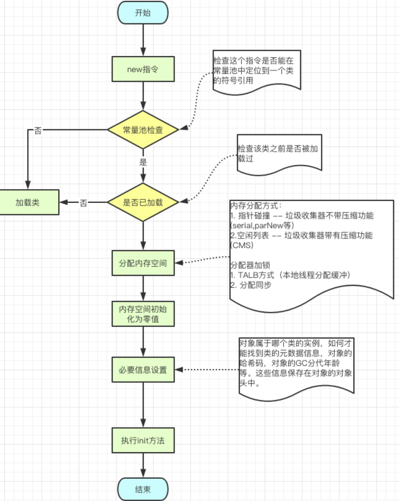

# 4.2 对象内存分配的方式
1. 指针碰撞 Bump the Pointer

   - GC 不带压缩功能

   - 内存地址是连续（新生代）

   - serial 收集器，parNew 收集器等

     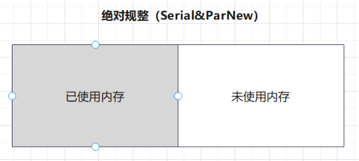

2. 空闲列表 Free List

   - GC 带压缩功能

   - 内存地址不连续（老年代）

   - CMS 收集器，Mark-Sweep 收集器

     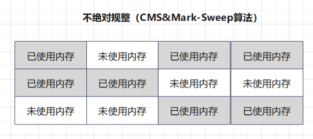

# 4.3 对象内存分配的安全问题
1. 在分配内存的时候，虚拟机给A线程分配内存过程中，指针未修改。此时B线程同时使用了同样一块内存。是不是就出现了线程的安全性问题
2. 解决方案：给对象分配内存时，首先进行TLAB的分配。当对象大于TLAB中的剩余内存或TLAB的内存已用尽时，再采用CAS进行内存分配

# 4.4 对象内存分配的过程
1. 分配流程

   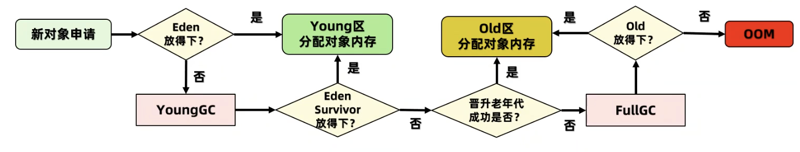

   - **内存分配过程可视化案例**

     - 执行如下程序，在 VisualVM 中的观察动态效果

       ```java
       public class HeapMemoryAllocation {
       
           public static void main(String[] args) throws InterruptedException {
               List<Object> list = new ArrayList<>();
               while (true) {
                   list.add(new byte[1024 * 1024]);
                   Thread.sleep(20);
               }
           }
       
       }
       ```

2. 进入老年代的时机

   - 年龄大，经过 15 次 MinorGC 可通过 -XX:MaxTenuringThreshold 指定

   - 动态年龄判断

     - MinorGC 之后，发现 Survivor 区中年龄分别为年龄1+年龄2+年龄n的多个对象，对象总和大小超过了 Survivor 区域的50%，此时就会把年龄 n 及以上的对象都放入老年代。 
     - 可通过 -XX:TargetSurvivorRatio可以指定比例

   - 大对象直接进入老年代

     - 避免大对象在Eden和Survivor区的复制操作降低效率

     - 可通过 -XX:PretenureSizeThreshold 指定，默认超过 1M 为大对象

     - **大对象创建直接进入老年代案例**

       ```java
       public class BigObjectCreate {
       
           public static void main(String[] args)
                   throws InterruptedException {
               byte[] buffer = new byte[1024 * 1024 * 20];
               Thread.sleep(1000 * 60 * 60);
           }
       }
       ```

       - 运行参数：-Xmx60m -Xms60m -XX:NewRatio=2 -XX:SurvivorRatio=8

       - 结果观察

         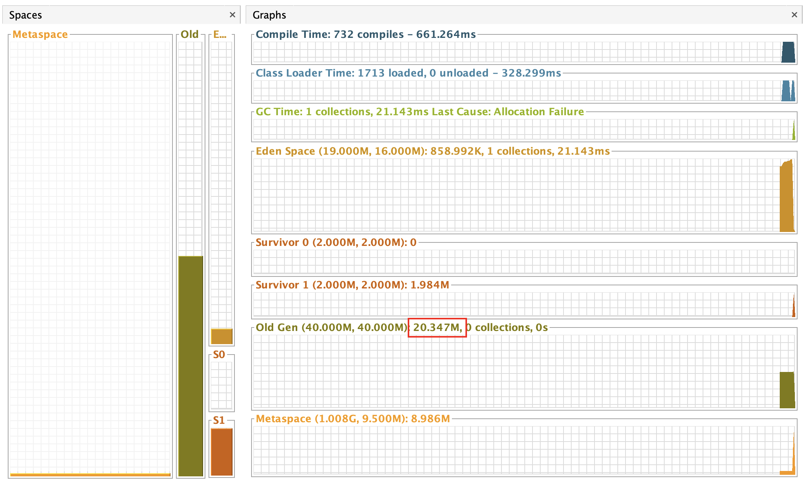

   - MinorGC 后存活对象太多，无法放入 Survivor

   - 老年代的内存担保

     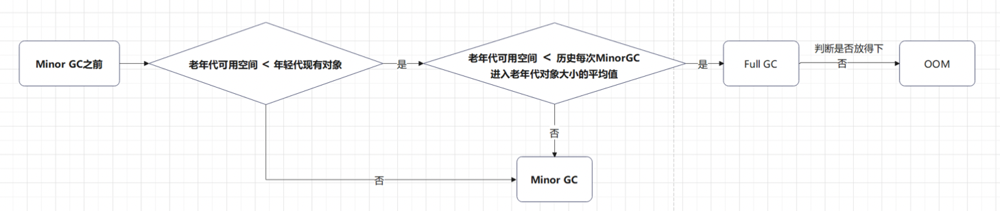

     - 当新生代无法分配内存的时候，将新生代的对象转移到老年代，然后把新对象放入腾空的新生代

     - 内存担保案例

       ```java
       public class MemoryAllocationGuarantee {
       
           private static final int _1MB = 1024 * 1024;
       
           public static void main(String[] args) throws InterruptedException {
               byte[] allocation1, allocation2, allocation3, allocation4;
               allocation1 = new byte[1 * _1MB];//1M
               allocation2 = new byte[1 * _1MB];//1M
               allocation3 = new byte[1 * _1MB];//1M
               allocation4 = new byte[6 * _1MB];//6M
           }
       }
       ```

       - 结论：三个 1M 的对象进入老年代

         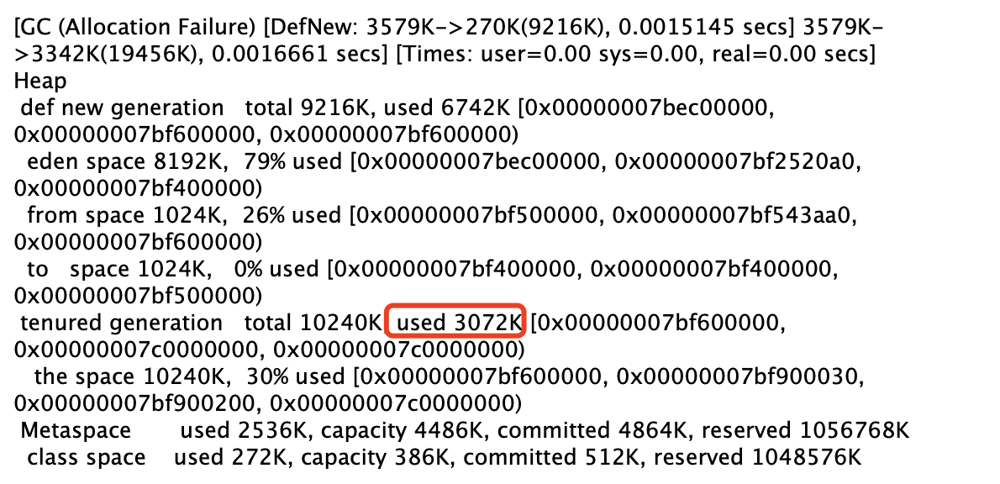

# 4.5 对象的内存布局

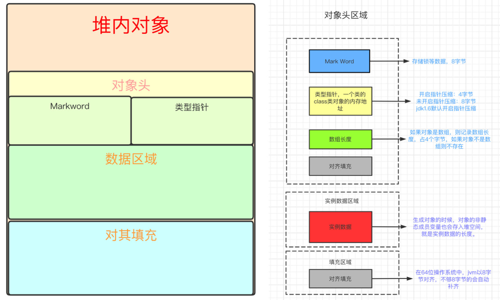

1. 对象的内存布局划分

   - 对象头(Header): Java对象头占8byte。如果是数组则占12byte。因为JVM里数组size需要使用4byte存储。 
     - 标记字段MarkWord:
       - 用于存储对象自身的运行时数据，它是synchronized实现轻量级锁和偏向锁的关键。
       - 默认存储:对象HashCode、GC分代年龄、锁状态等等信息。
       - 为了节省空间，也会随着锁标志位的变化，存储数据发生变化。下面画图解释
     - 类型指针KlassPoint:
       - 是对象指向它的类元数据的指针，虚拟机通过这个指针来确定这个对象是哪个类的实例
       - 开启指针压缩存储空间4byte，不开启8byte。JDK1.6+默认开启 
     - 数组长度:如果对象是数组，则记录数组长度，占4个byte，如果对象不是数组则不存在。
     - 对齐填充:保证数组的大小永远是8byte的整数倍。
   - 实例数据(Instance Data):生成对象的时候，对象的非静态成员变量也会存入堆空间 
   - 对齐填充(Padding):JVM内对象都采用8byte对齐，不够8byte的会自动补齐。

2. 对象头详解

   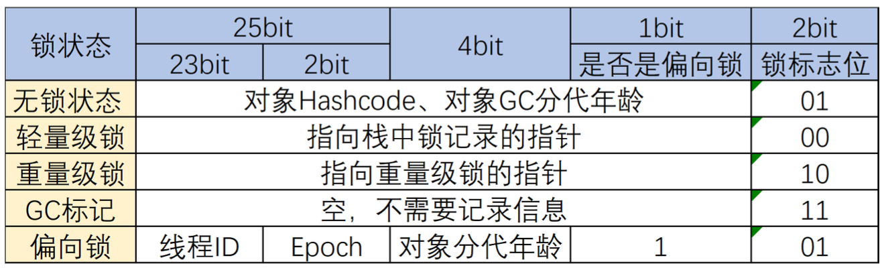

   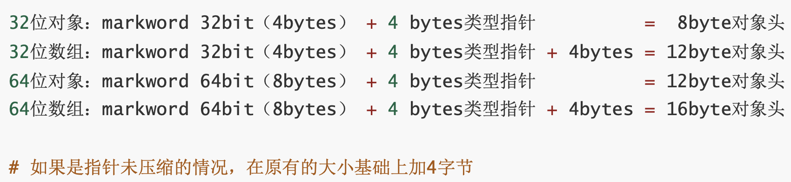

3. 基本数据类型和包装类的内存占用情况

   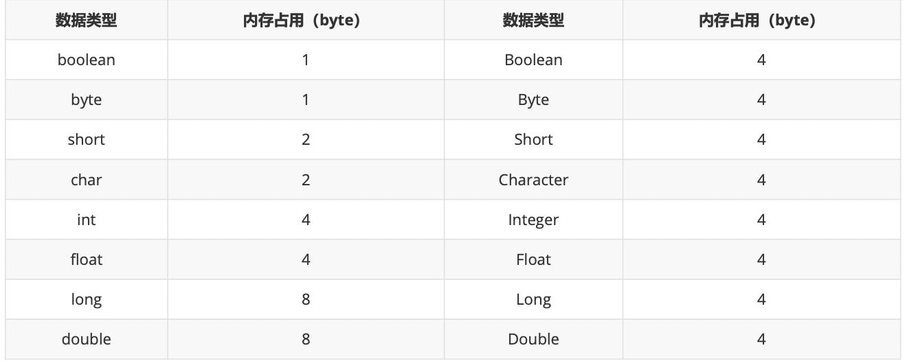

**打印空对象的内存布局信息案例**

1. 需要引入依赖

   ```xml
   <dependency>
       <groupId>org.openjdk.jol</groupId>
       <artifactId>jol-core</artifactId>
       <version>0.9</version>
   </dependency>
   ```

2. 执行代码

   ```java
   public class ObjectMemoryPrint {
   
       public static void main(String[] args) {
           Object o = new Object();
           System.out.println("new Object:" +
                   ClassLayout.parseInstance(o).toPrintable());
       }
   
       @Data
       @Builder
       static class People{
           private boolean adult;
           private int age;
           private String name;
       }
   
   }
   ```

3. 执行结果

   - 指针压缩默认开启

     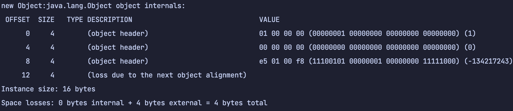

   - 关闭指针压缩：`-XX:-UseCompressedOops`

     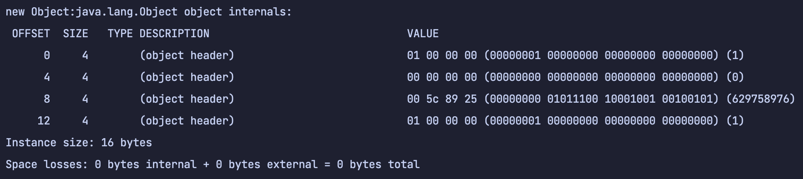

**打印空对象和赋值后的对象内存布局信息案例**

1. 执行代码

   ```java
   public class ObjectMemoryPrint {
   
       public static void main(String[] args) {
           System.out.println(ClassLayout.parseInstance(People.builder().build()).toPrintable());
           System.out.println(ClassLayout.parseInstance(People.builder()
                   .age(18)
                   .name("Tom")
                   .adult(true)
                   .build()).toPrintable());
       }
   
       @Data
       @Builder
       static class People{
           private boolean adult;
           private int age;
           private String name;
       }
   
   }
   ```

2. 执行结果

   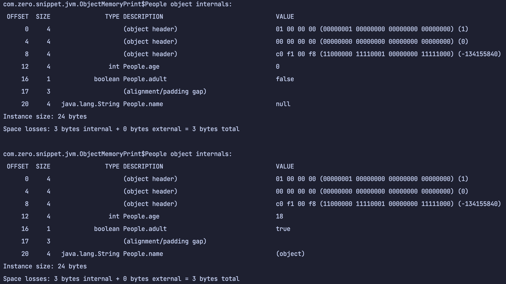

3. 结论：示例数据是否赋值不影响占用空间大小

# 4.6 对象的访问

1. 通过句柄访问对象

   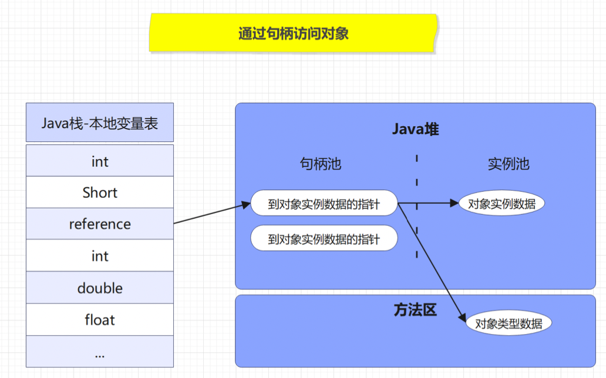

2. 通过直接指针访问对象

   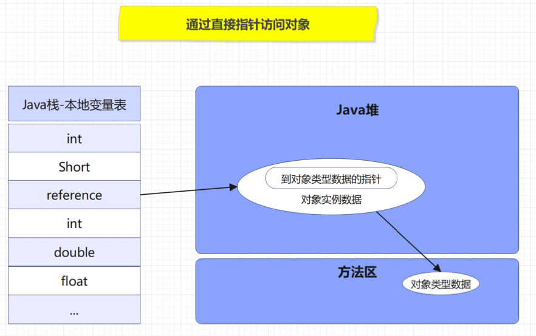