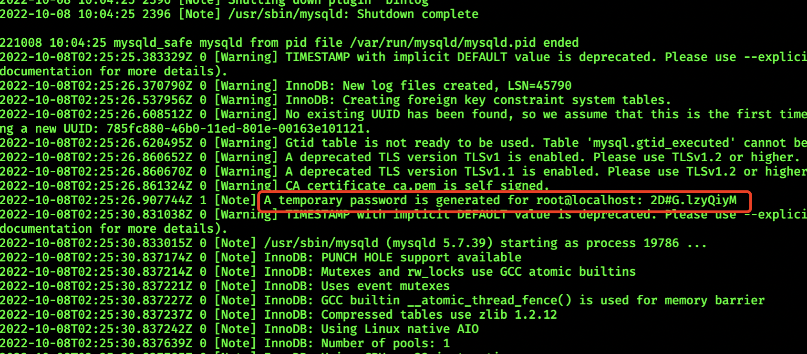

> 操作系统: CentOS 7.6
>
> MySQL: 5.7

```
# 查看已安装的 MySQL
rpm -qa|grep mysql

# 卸载已安装的 MySQL
yum remove -y mysql mysql-libs mysql-common
rm -rf /var/lib/mysql
rm /etc/my.cnf

# 添加 yum 源
sudo rpm -Uvh https://repo.mysql.com//mysql80-community-release-el7-3.noarch.rpm

# 查看 Yum 存储库中的所有子存储库，并查看其中哪些子存储库已启用或禁用 
yum repolist all | grep mysql

# 安装 yum-config-manager 工具
yum -y install yum-utils

# 关闭mysql8的下载源
yum-config-manager --disable mysql80-community

# 开启mysql5.7下载源
yum-config-manager --enable mysql57-community

# 执行安装
yum install -y mysql-community-server --nogpgcheck

# 配置
vim /etc/my.cnf

# 修改如下内容
[mysqld]
# MySQL设置大小写不敏感:默认:区分表名的大小写，不区分列名的大小写 # 0:大小写敏感 1:大小写不敏感
lower_case_table_names=1
# 默认字符集
character-set-server=utf8

# 启动
systemctl start mysqld

# 在日志中查看临时密码
cat /var/log/mysqld.log
```



```
# 登录 mysql
mysql -uroot -p2D#G.lzyQiyM

# 设置密码长度最低位数
mysql> set global validate_password_length=4;

# 设置密码强度级别
mysql> set global validate_password_policy=0;

# 修改密码
mysql> alter user 'root'@'localhost' identified by 'root'; 

# 进入 mysql 数据库:
mysql> use mysql;

# 查看user表中的数据:
mysql> select Host, User from user;

# 修改user表中的Host，% 代表任意的客户端,可替换成具体IP地址
mysql> update user set Host='%' where User='root'; 

# 刷新权限
mysql> flush privileges;

# 更改权限
mysql> alter user 'root'@'%' identified by 'root';

# 刷新权限
mysql> flush privileges;

# 远程连接授权
mysql> GRANT ALL PRIVILEGES ON *.* TO 'root'@'%' IDENTIFIED BY 'root' WITH GRANT OPTION;

# 刷新权限
mysql> flush privileges;
```


```
# 拓展：关闭 linux 防火墙、SELinux

# 关闭防火墙
systemctl stop firewalld(默认)
systemctl disable firewalld.service(设置开启不启动)

# 查看 SELinux 状态
/usr/sbin/sestatus -v 
# 也可以用这个命令检查
getenforce

# 临时关闭SELinux
setenforce 0

# 永久关闭（需重启服务器）
vim /etc/selinux/config
# 配置如下参数并保存
SELINUX=disabled
```

