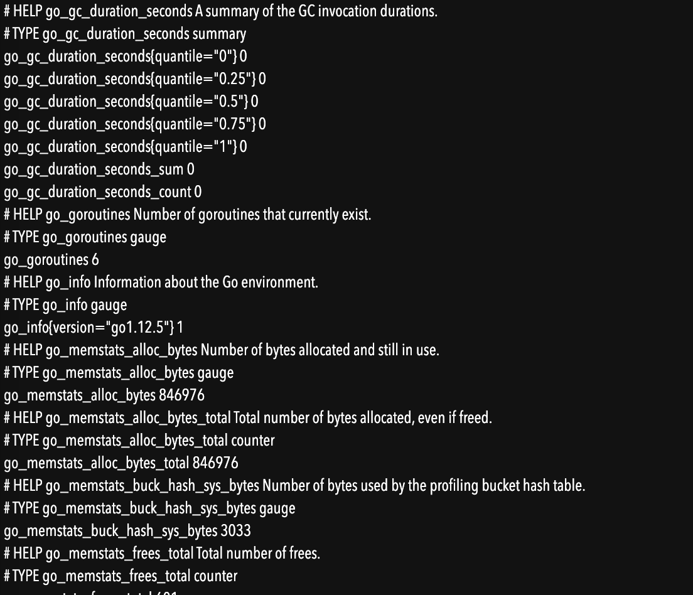
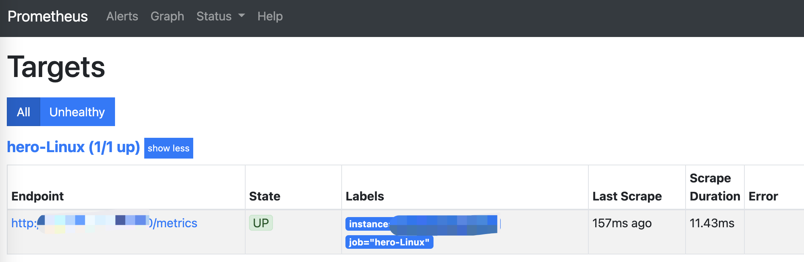
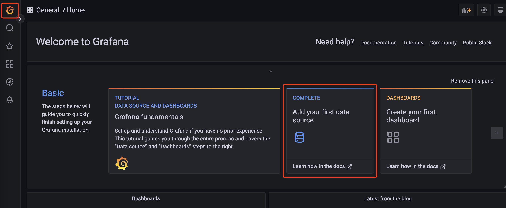
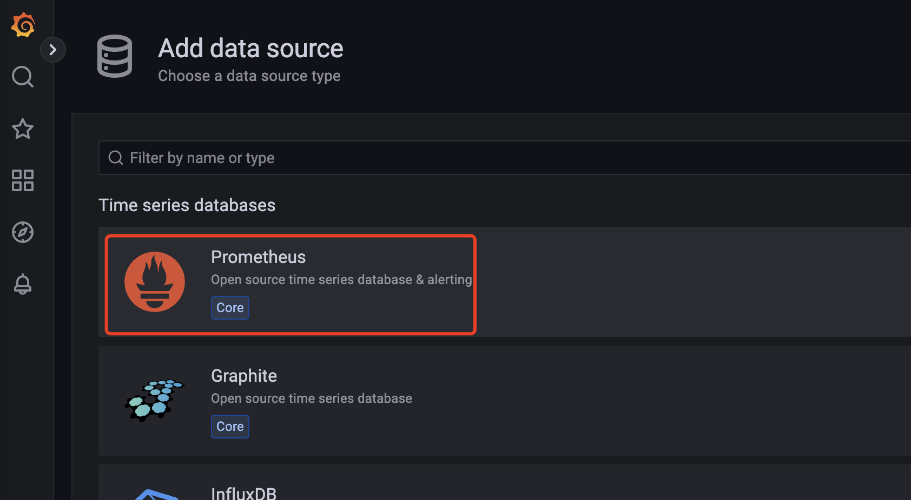
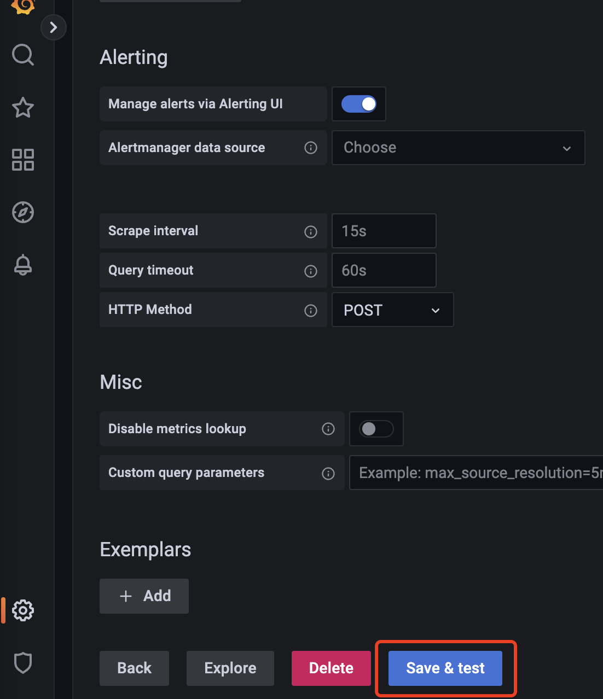
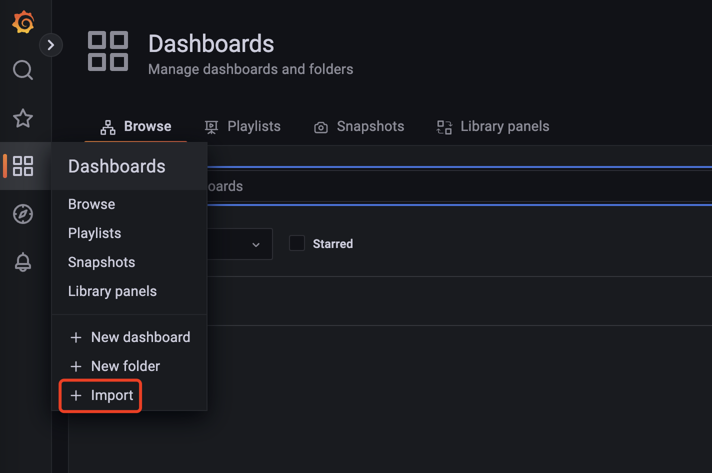
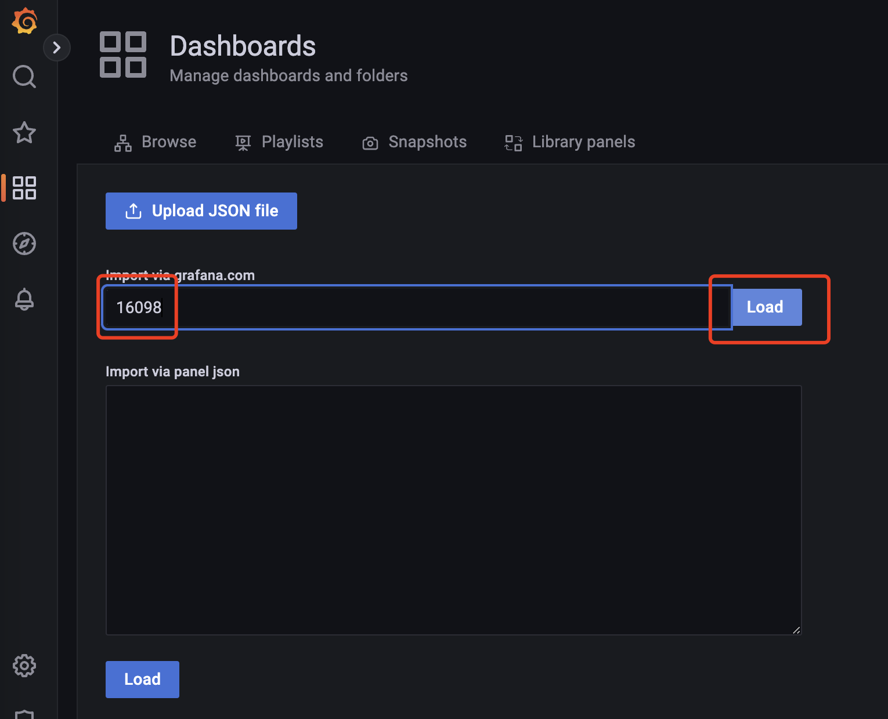
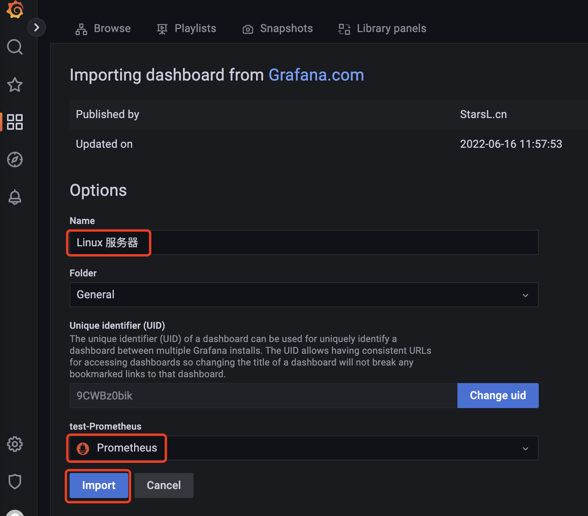

电脑：mac m1

ssh客户端：Termius 

阿里云服务器：2核(vCPU)8 GiB 系统：CentOS 7.6 64位

### JDK安装

```shell
#1. 查看当前Linux系统是否已经安装java
rpm -qa | grep -i java
    
#2. 通过 Termius SFTP 功能将 jdk-8u261-linux-x64.tar.gz 上传到服务器 /root 目录，解压已上传的JDK压缩包，并移动到/usr/local目录下
mkdir /usr/local/hero
tar -zxvf /root/jdk-8u261-linux-x64.tar.gz -C /usr/local/hero

#3. 测试jdk
/usr/local/hero/jdk1.8.0_261/bin/java -version
    
#4. 配置环境变量
vim /etc/profile
     shift+G 跳转到最后一行
     i 进入插入模式
     export JAVA_HOME=/usr/local/hero/jdk1.8.0_261
     export PATH=$PATH:$JAVA_HOME/bin
     esc 进入命令行模式
     :wq! 保存
  
#5. 更新环境变量
source /etc/profile
  
#6. 测试
java -version
```

### 配置Docker环境

```shell
#1. yum 包更新到最新
sudo yum update

#2. 安装需要的软件包，yum-util 提供yum-config-manager功能，另外两个是devicemapper驱动依赖 的
sudo yum install -y yum-utils device-mapper-persistent-data lvm2

#3. 设置yum源为阿里云
sudo yum-config-manager --add-repo http://mirrors.aliyun.com/docker-ce/linux/centos/docker-ce.repo

#4. 安装Docker
sudo yum install docker-ce

#5. 启动
systemctl start docker

#6. 查看dcoker版本
docker -v
```

### 安装InfluxDB（使用Docker安装）

```shell
#1. 下载InfluxDB的镜像
docker pull influxdb:1.8

#2. 启动InfluxDB的容器，并将端口 8083 和 8086 映射出来
docker run -d --name influxdb -p 8086:8086 -p 8083:8083 influxdb:1.8

#3. 进入容器内部
docker exec -it influxdb /bin/bash

#4. 进入influx命令行
influx

#5. 创建名为jmeter的数据库
create database jmeter

#6. 查看数据库
show databases

#7. 使用创建的数据库
use jmeter

#8. 查看数据
select * from jmeter
```

### 安装ServerAgent

```shell
#1. 通过 Termius SFTP 功能将 ServerAgent-2.2.3.zip 上传到服务器 /root 目录，也可通过如下命令下载，但 github 有时不可用
wget -c https://github.com/undera/perfmon-agent/releases/download/2.2.3/ServerAgent-2.2.3.zip

#2. 安装 zip unzip 工具
yum install -y unzip zip

#3. 解压
mkdir /usr/local/hero/
unzip -d /usr/local/hero/ ServerAgent-2.2.3.zip

#4. 服务启动默认4444端口，根本连接不上，因此自己创建一个部署脚本文件对此进行部署，且把端口修 改为7879
cd /usr/local/hero/ServerAgent-2.2.3/
nohup java -jar ./CMDRunner.jar --tool PerfMonAgent --udp-port 7879 --tcp-port 7879 > log.log 2>&1 &

#5. 赋予可执行权限
chmod 755 startAgent.sh
```


### 安装Grafana（使用Docker安装）

```shell
#1. 下载Grafana镜像
docker pull grafana/grafana

#2. 启动Grafana容
docker run -d --name grafana -p 3000:3000 grafana/grafana

#3. 浏览器访问Grafana： http://ip:port/3000  默认密码 admin/admin
```

### 安装node_exporter

```shell
#1. 通过 Termius SFTP 功能将 node_exporter-0.18.1.linux-amd64.tar.gz 上传到服务器 /root 目录，也可通过如下命令下载，但 github 有时不可用
wget -c https://github.com/prometheus/node_exporter/releases/download/v0.18.1/node_ex porter-0.18.1.linux-amd64.tar.gz

#2. 解压
mkdir /usr/local/hero/
tar zxvf node_exporter-0.18.1.linux-amd64.tar.gz -C /usr/local/hero/

#3. 启动
cd /usr/local/hero/node_exporter-0.18.1.linux-amd64
nohup ./node_exporter > node.log 2>&1 &

#4. 查看效果，浏览器访问 http://ip:9100/metrics 能获得数据
```



### 安装Prometheus

```shell
#1. 通过 Termius SFTP 功能将 prometheus-2.15.1.linux-amd64.tar.gz 上传到服务器 /root 目录，也可通过如下命令下载，但 github 有时不可用
wget -c https://github.com/prometheus/prometheus/releases/download/v2.15.1/prometheus -2.15.1.linux-amd64.tar.gz

#2. 解压
mkdir /usr/local/hero/
tar zxvf prometheus-2.15.1.linux-amd64.tar.gz -C /usr/local/hero/
cd /usr/local/hero/prometheus-2.15.1.linux-amd64

#3. 运行
nohup ./prometheus > prometheus.log 2>&1 &

#4. 配置
cd /usr/local/hero/prometheus-2.15.1.linux-amd64
vim prometheus.yml
	# 添加如下内容
  - job_name: 'hero-Linux'
    static_configs:
    - targets: ['47.94.155.236:9100']
   
#5. 查看是否安装成功，浏览器访问：http://ip:9090/targets
```



### 配置Grafana














模板库：https://grafana.com/grafana/dashboards/?plcmt=footer

### Mysql 安装

```shell
#1. 添加mysql社区
sudo rpm -Uvh http://dev.mysql.com/get/mysql-community-release-el7-5.noarch.rpm

#2. 安装
yum install mysql-community-server.x86_64

#3. 启动(卡主，查阅后发现是 root 账号不能启动)
service mysqld start

#4. 创建 mysql 账号
adduser mysql
passwd mysql
usermod -aG wheel mysql


#5. 使 用 mysql 账号启动
su - mysql
service mysqld start

#6. 还是卡住，查看启动日志
tail -f /var/log/mysqld.log
	# Fatal error: Can't open and lock privilege tables: Table 		  'mysql.user' doesn't exist
	
#7.  百度该问题，执行如下命令
mysql_install_db

#8. 重启、成功
service mysqld restart

#9. 进入命令行（密码默认为空）
mysql -uroot -p
	#修改密码
	SET PASSWORD = PASSWORD('root');
	#开启远程访问
	update user set host='%' where user='root';
	FLUSH PRIVILEGES;

#10. 使用客户端远程连接 mysql ，创建 hero_all 数据库并执行 hero_all.sql

#11. 使用 vim 修改启动 jar 包中 application-dev.yml 中的数据库配置
# vim命令参考 https://blog.csdn.net/csdnzouqi/article/details/90169728

#12. 替代换行符并启动该服务
sed -i 's/\r//' startup.sh
sed -i 's/\r//' stop.sh
sh startup.sh
```

