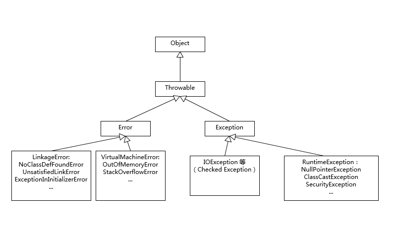

## 异常处理机制

---

### 1. Exception 和 Error 的区别

1. Java 中只有 Throwable 类型的实例可以被抛出或捕获，它是异常处理的基本组成类型

2. Exception 和 Error 都继承了 Throwable

3. Exception 属于程序正常运行中可以预料的异常情况，应该被捕获并进行相应处理

4. Error 一般会导致程序处于非正常不可恢复的状态码，不便于也不需要被捕获，比如 OutOfMemoryError 

---

### 2. Exception 分类

1. 分为可检查异常 checked 和不可检查异常 unchecked

2. 可检查异常必须进行显式捕获处理，在编译器会检查

3. 不可检查异常就是运行时异常，类似 NullPointerException、ArrayIndexOutOfBoundsException，通常是编码可避免的逻辑错误，不会再编译器强制要求捕获

4. 有哪些常见的异常？

   

5. NoClassDefFoundError 和 ClassNotFoundException 的区别

- ClassNotFoundException发生在装入阶段。当应用程序试图通过类的字符串名称，使用常规的三种方法装入类，但却找不到指定名称的类定义时就抛出该异常。

- NoClassDefFoundError： 当目前执行的类已经编译，但是找不到它的定义时，也就是说你如果编译了一个类 B ，在类 A 中调用，编译完成以后，你又删除掉 B ，运行 A 的时候那么就会出现这个错误

---

### 3. 开发过程需要注意的点

1. try-with-resources 和 multiple catch 的使用
> try-with-resources 在编译时期，会自动生成相应的处理逻辑，比如，自动按照约定俗成close 那些扩展了AutoCloseable 或者 Closeable 的对象

    ```java
    try (BufferedReader br = new BufferedReader(…);
         BufferedWriter writer = new BufferedWriter(…)) {
        ...
         }
    catch ( IOException | XEception e) {
        ...
    } 
    ```

2. 尽量不要 catch 类似 Exception 这样的通用异常，捕获特定异常

3. 不要生吞异常

4. 不要通过e.printStackTrace()来打印异常

5. 异常输出要脱敏

6. try-catch 会产生额外的性能开销，影响 JVM 对代码的优化，所以 try 尽可能少的代码段

7. 不要将 try-catch 用于流程控制，使用 if/else/switch 更高效

8. Java 每实例化一个 Exception 都会对当时的栈进行快照，尽量不要在循环中使用 try-catch

---
