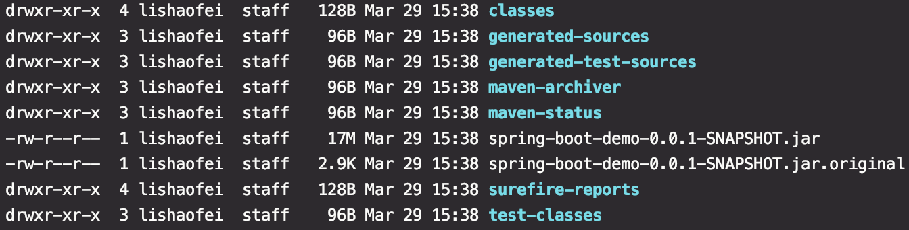

spring boot 默认生成的 pom 中包含：

```xml
	<build>
		<plugins>
			<plugin>
				<groupId>org.springframework.boot</groupId>
				<artifactId>spring-boot-maven-plugin</artifactId>
			</plugin>
		</plugins>
	</build>
```

用于 mvn 打包时生成可执行的 spring boot jar 包 

使用 `mvn clean package` 进行打包，在 target 目录下回生成两个 jar 包



其中原始 jar.original 不包含依赖，jar 为可直接运行的 spring boot 程序

---

使用 spring boot 官方生成器生成的项目默认指定了 mvn 的 parent 如果项目自身需要指定特定的 parent，可以用另外一种配置方式实现对 spring boot 各种模块的依赖，详见 pom-without-parent.xml

```xml
<?xml version="1.0" encoding="UTF-8"?>
<project xmlns="http://maven.apache.org/POM/4.0.0" xmlns:xsi="http://www.w3.org/2001/XMLSchema-instance"
		 xsi:schemaLocation="http://maven.apache.org/POM/4.0.0 http://maven.apache.org/xsd/maven-4.0.0.xsd">
	<modelVersion>4.0.0</modelVersion>

	<groupId>geektime.demo</groupId>
	<artifactId>helloworld</artifactId>
	<version>0.0.1-SNAPSHOT</version>
	<name>HelloWorld</name>
	<description>Demo project for Spring Boot</description>

	<properties>
		<java.version>1.8</java.version>
	</properties>

  <!-- 实现等同于默认的 pom 文件中 parent 的依赖管理 -->
	<dependencyManagement>
		<dependencies>
			<dependency>
				<groupId>org.springframework.boot</groupId>
				<artifactId>spring-boot-dependencies</artifactId>
				<version>2.1.1.RELEASE</version>
				<type>pom</type>
				<scope>import</scope>
			</dependency>
		</dependencies>
	</dependencyManagement>

	<dependencies>
		<dependency>
			<groupId>org.springframework.boot</groupId>
			<artifactId>spring-boot-starter-web</artifactId>
		</dependency>

		<dependency>
			<groupId>org.springframework.boot</groupId>
			<artifactId>spring-boot-starter-test</artifactId>
			<scope>test</scope>
		</dependency>
	</dependencies>

	<build>
		<plugins>
			<plugin>
				<groupId>org.springframework.boot</groupId>
				<artifactId>spring-boot-maven-plugin</artifactId>
				<version>2.1.1.RELEASE</version>
				<executions>
					<execution>
						<goals>
							<goal>repackage</goal>
						</goals>
					</execution>
				</executions>
			</plugin>
		</plugins>
	</build>

</project>
```

